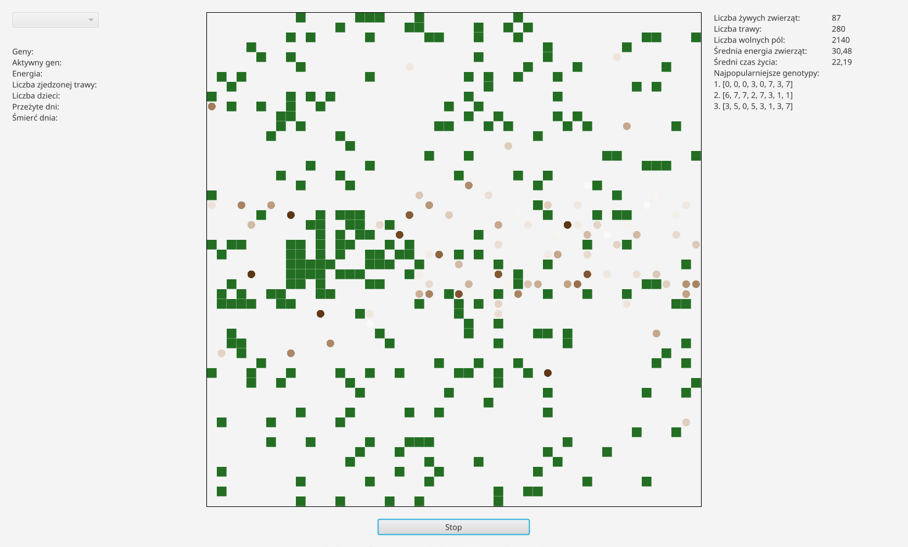

# Symulacja ewolucyjna

Symulacja pozwalająca prześledzić ewolucję prostych zwierząt.

Zwierzęta poruszają się według informacji zapisanej w ich genomie. Dwoje zwierząt mających wsytarczającą ilość energi może się rozmnażać, a genom dziecka to kombinacja ich genomów z drobną, losową mutacją. Jeśli jednak energia jakiegoś zwierzęcia spadnie do zera to umiera. W walce o przetrwanie wygrywają tylko najsilniejsi 🙂.

Interfejs zaimplementowany za pomocą JavaFX.



## Uruchamianie

```sh
./gradlew run
```